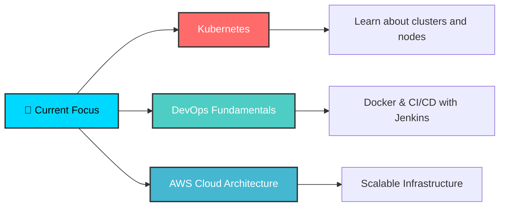

# 🚀 Hey there! I'm Jeremy Andrés Guzmán Vargas

  
  

---

### 🎓 **Informatics & Multimedia Technology Student** @ University of Costa Rica
### 💼 **Backend Developer | Future DevOps Engineer | Cloud Enthusiast**

## 🌟 About Me

## 🛠️ **Tech Arsenal**

<table align="center">
<tr>
<td align="center" width="50%">

### 🔥 **Backend & APIs**

</td>
<td align="center" width="50%">

### 🎨 **Frontend & Design**

</td>
</tr>
<tr>
<td align="center">

### 🗄️ **Databases**

</td>
<td align="center">

### ☁️ **DevOps & Cloud**

</td>
</tr>
</table>

---

## 🏆 **Featured Projects**

<table>
<tr>
<td width="50%">

### 🛒 **Marlin E-commerce**
*Empowering Costa Rican Entrepreneurs*

**🎯 Role:** Backend Developer  
**⚡ Stack:** Django, DRF, PostgreSQL, JWT

**✨ Key Features:**
- 🔐 Secure authentication system
- 🏪 Advanced store management
- 📦 Dynamic product variations
- 🚚 Smart delivery calculations

</td>
<td width="50%">

### 🌐 **PyCon LATAM 2024 & 2025**
*Building Community Bridges*

**🎯 Role:** Full-Stack Developer  
**⚡ Stack:** Multi-language platform

**✨ Achievements:**
- 🌍 Bilingual website development
- 📈 Community engagement boost
- 🎨 Modern landing pages
- 🤝 International collaboration

</td>
</tr>
</table>

---

## 📊 **GitHub Analytics**

---

## 🌱 **Current Learning Journey**

---

## 🤝 **Let's Connect & Collaborate!**

### 💡 Open to:
- 🤝 Backend development collaborations
- ☁️ DevOps and cloud projects  
- 🚀 Innovative startup opportunities
- 🌟 Open source contributions

---

